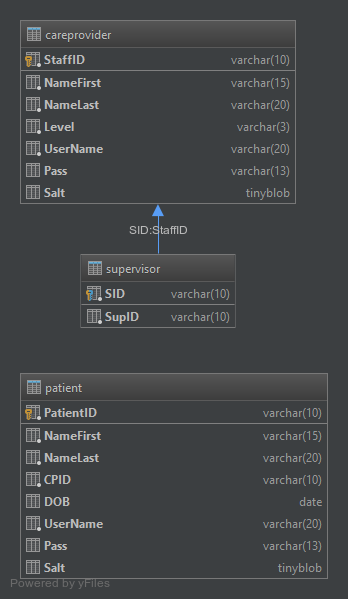

# Blog: Hand Mobility Monitoring and Analysis

**Richard Carragher**

## HAND MOBILITY MONITORING AND ANALYSIS USING A LEAP MOTION CONTROLLER

My final year project idea is to create an exercise web application that enables users to perform a set of hand exercises online through the use of a browser and a leap motion controller and log the results into a database for a care provider to review.

The idea comes from different places. First there are many applications created to track a users exercise route, however each one of these only logs what a user says they have done without any means to check if it is true or not. These applications have become so popular over the past few years and there have been companies that have developed applications that track patient exercises for care providers to see and demos that show how to do exercises. However these applications still only log what the user says they have done.

With this project the idea is to have the user perform the exercise on the web application and track and analysis there hand movements to get accurate readings of how they are improving. The system will provide a way for care providers to see this information and adjust their patients exercise route.

## WEB DEVELOPMENT STACK CHOICES

For the web application to be made it needs to hosted on a web server. This means a choice in what web server technology should be used has to be made. I have found three popular options MEAN stack, LAMP stack and tomcat/java.

### MEAN Stack
The mean is a MongoDB, Express,  AngularJS, and Node.js stack.  When researching this stack the main sources of issues I found where with MongoDB.

MongoDB is a  NoSQL database that is known in web development for been scalable. However while researching I found that MongoDB has some issues with reading stale data and acknowledgements for unsuccessful  writes coming back as successful. These two problems were caused by the design of MongoDB. Because the database for this project is going to be handling medical data of a patients hand mobility were up to date and accurate reading are necessary.

### LAMP Stack and Tomcat
These two options are vary popular and both have been around a lot longer then the mean stack. With the two stacks the main concern was with java vs php as tomcat can run on linux, and mysql can be connected to from both java and php. When researching the two for back end server development I found a lot of comments about php been less secure then java. A lot of these comments however never said how or why this was, and none gave sources to claims they made.

I was able to find a research paper  “Idea: Java vs. PHP: Security Implications of Language Choice for Web Applications”. This paper and other research pointed to php and java not been that different with their level of security. If anything it came from the fact that php can be used as a starter language for server side programming, while java would be used client side first then server side. So flaws in someones code was the source of leaks rather then the language itself.

### Decision
Based of the result of researching the security concerns between php and java, I have decided to go with a LAMP stack for the project. This is because out of the three options it has the best integration together with php been easier to interact with html then java.

##LEAP MOTION MEDICAL APPLICATIONS

The leap motion controller is a relatively new technology with it been release just over 3  years ago. The leap controller itself has not seen any improvements since then in terms of hardware but instead software updates for better reading of hand movements.

While researching if the leap motion could be used for this project I found that there had been research and some developments done on the medical applications of the leap controller. I found a few papers that detailed the leaps limitations with accuracy falling when going to far up or two the side of the leaps field of vision (“An Analysis of the Precision and Reliability of the Leap Motion Sensor and Its Suitability for Static and Dynamic Tracking “), the limitation of accuracy with some hand shapes (“The Leap Motion controller: A view on sign language”) and the leaps infrequent input (“An Analysis of the Precision and Reliability of the Leap Motion Sensor and Its Suitability for Static and Dynamic Tracking “).

All the papers I found however were done the year the leap came out or a year later. Updates to the software has improved tracking of the leap with this and the leap motions push for more improvements because of there market space in VR, I believe that the leap motion is best suited to this project as other sensor tech is not as pushed as much as the leap, with the exception of the xbox kinect. As well as the leap motions range of languages that the API supports.

##SVG vs Canvas vs WebGL

For the project I'm going to have a set of exercises that the user will complete using a leap motion connected to their computer. To do this I plan to create games that will get the user to move their hands in the motion needed for the exercise. To do this animation is needed and keeping track of elements and changing them based on the users hand movements each of the options SVG, Canvas and WebGL give this feature with SVG enabling event handlers easier then canvas. However SVG seems to have some performance issues with rendering a large number of objects. Since the leap takes up a lot of resources when processing users input and its input frequency is connected to the performance of the computer SVG doesn't seem to be a good choice.

Between Canvas 2D and WebGL, WebGL offers more performance due to its more programmable aspects such as it shader language GLSL and that it uses a computers graphics hardware to handle graphics instead of the cpu, if a gpu is present.For this reason I have selected webgl for the graphics/animation of the exercises for the project.

##Hand Exercises 

For the project I have researched various hand exercises and have came up with different game ideas for them.

###Separation of fingers and closing of separation

####Measurement
 Angle between each finger, recording the average,min and max values for the angles between each finger.
 
####Game element
There will be a gate that the users angles will open and close. It starts of with it been closed and when the user separated their fingers they will open the gate.
 
There will be falling items from the top of the screen these will be for the user to indicate when the gates must be open and for how long.

###Thumb flexion/extension

####Measurement
The distance between the top of the thumb and the base of a finger. Again for each finger and getting the average, smallest and largest distances.
 
####Game element
There will be a four key/stone input having your thumb over the base of one finger will cause the key to light up.
 
There will be colored circles dropped under from the top of the screen. These will down onto one of the four keys and the user will move their thumb to that key. At this point the recording for the user's thumbs location will be taken as the distance from the thumb's tip to the base of the fingers base for that key.
  
Only one key at a time for a finger and they will be be repeated from the same finger in a row. ie no index, index but index, middle, index is ok.

###Wrist extension and flexion

####Measurement
If I get the location of the arm and the palm of the hand of the same arm I can work out the angle of the wrist is making when it is bent up and down, left and right.
 
####Game element
The idea for this game is based on Pong. When the user move their wrist left or right, up or down a pong will move the same direction to block incoming objects. 

##login System

For the project a login system is required for both care providers and patients so that they can interact with their information only.

Like most login systems it takes a user name and password. The password is hashed with a salt that is stored in a database along with username and the hash itself. Each salt is randomly generated when a user is placed on the database. The php method openssl_random_pseudo_bytes is used to create the salt and crypt for the one way hashing of the password and salt together and then stored on the database for the user to login.
 
At the moment the database scheme looks like.

To pervert SQL injections in the login system I use the php method  mysqli_real_escape_string to make sure there are not ' or other charachers that could alter the mysql query been executed to the database.