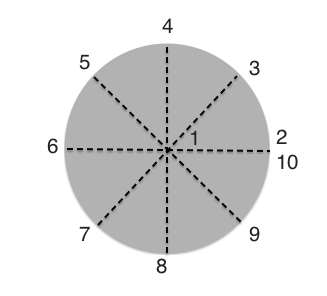
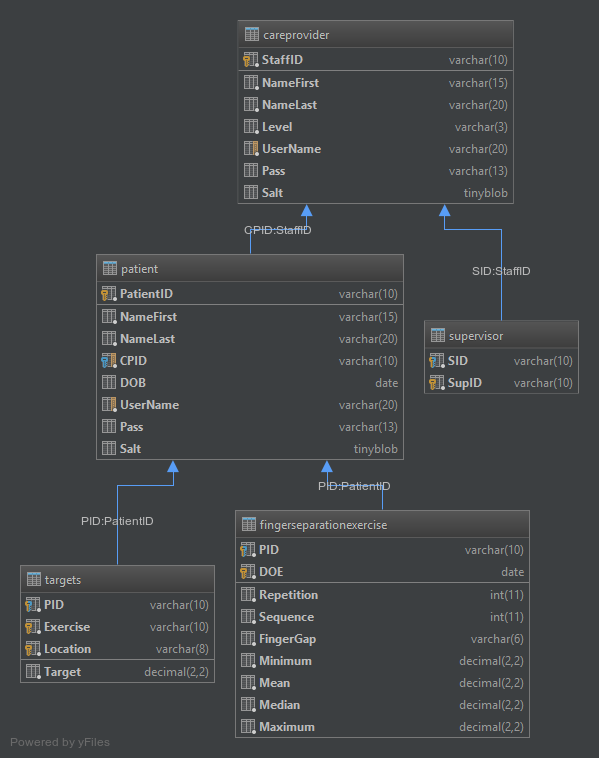

# Blog: Hand Mobility Monitoring and Analysis

**Richard Carragher**

## HAND MOBILITY MONITORING AND ANALYSIS USING A LEAP MOTION CONTROLLER

My final year project idea is to create an exercise web application that enables users to perform a set of hand exercises online through the use of a browser and a leap motion controller and log the results into a database for a care provider to review.

The idea comes from different places. First there are many applications created to track a users exercise route, however each one of these only logs what a user says they have done without any means to check if it is true or not. These applications have become so popular over the past few years and there have been companies that have developed applications that track patient exercises for care providers to see and demos that show how to do exercises. However these applications still only log what the user says they have done.

With this project the idea is to have the user perform the exercise on the web application and track and analysis there hand movements to get accurate readings of how they are improving. The system will provide a way for care providers to see this information and adjust their patients exercise route.

## WEB DEVELOPMENT STACK CHOICES

For the web application to be made it needs to hosted on a web server. This means a choice in what web server technology should be used has to be made. I have found three popular options MEAN stack, LAMP stack and tomcat/java.

### MEAN Stack
The mean is a MongoDB, Express,  AngularJS, and Node.js stack.  When researching this stack the main sources of issues I found where with MongoDB.

MongoDB is a  NoSQL database that is known in web development for been scalable. However while researching I found that MongoDB has some issues with reading stale data and acknowledgements for unsuccessful  writes coming back as successful. These two problems were caused by the design of MongoDB. Because the database for this project is going to be handling medical data of a patients hand mobility were up to date and accurate reading are necessary.

### LAMP Stack and Tomcat
These two options are vary popular and both have been around a lot longer then the mean stack. With the two stacks the main concern was with java vs php as tomcat can run on linux, and mysql can be connected to from both java and php. When researching the two for back end server development I found a lot of comments about php been less secure then java. A lot of these comments however never said how or why this was, and none gave sources to claims they made.

I was able to find a research paper  “Idea: Java vs. PHP: Security Implications of Language Choice for Web Applications”. This paper and other research pointed to php and java not been that different with their level of security. If anything it came from the fact that php can be used as a starter language for server side programming, while java would be used client side first then server side. So flaws in someones code was the source of leaks rather then the language itself.

### Decision
Based of the result of researching the security concerns between php and java, I have decided to go with a LAMP stack for the project. This is because out of the three options it has the best integration together with php been easier to interact with html then java.

##LEAP MOTION MEDICAL APPLICATIONS

The leap motion controller is a relatively new technology with it been release just over 3  years ago. The leap controller itself has not seen any improvements since then in terms of hardware but instead software updates for better reading of hand movements.

While researching if the leap motion could be used for this project I found that there had been research and some developments done on the medical applications of the leap controller. I found a few papers that detailed the leaps limitations with accuracy falling when going to far up or two the side of the leaps field of vision (“An Analysis of the Precision and Reliability of the Leap Motion Sensor and Its Suitability for Static and Dynamic Tracking “), the limitation of accuracy with some hand shapes (“The Leap Motion controller: A view on sign language”) and the leaps infrequent input (“An Analysis of the Precision and Reliability of the Leap Motion Sensor and Its Suitability for Static and Dynamic Tracking “).

All the papers I found however were done the year the leap came out or a year later. Updates to the software has improved tracking of the leap with this and the leap motions push for more improvements because of there market space in VR, I believe that the leap motion is best suited to this project as other sensor tech is not as pushed as much as the leap, with the exception of the xbox kinect. As well as the leap motions range of languages that the API supports.

##SVG vs Canvas vs WebGL

For the project I'm going to have a set of exercises that the user will complete using a leap motion connected to their computer. To do this I plan to create games that will get the user to move their hands in the motion needed for the exercise. To do this animation is needed and keeping track of elements and changing them based on the users hand movements each of the options SVG, Canvas and WebGL give this feature with SVG enabling event handlers easier then canvas. However SVG seems to have some performance issues with rendering a large number of objects. Since the leap takes up a lot of resources when processing users input and its input frequency is connected to the performance of the computer SVG doesn't seem to be a good choice.

Between Canvas 2D and WebGL, WebGL offers more performance due to its more programmable aspects such as it shader language GLSL and that it uses a computers graphics hardware to handle graphics instead of the cpu, if a gpu is present.For this reason I have selected webgl for the graphics/animation of the exercises for the project.

##Hand Exercises 

For the project I have researched various hand exercises and have came up with different game ideas for them.

###Separation of fingers and closing of separation

####Measurement
 Angle between each finger, recording the average,min and max values for the angles between each finger.
 
####Game element
There will be a gate that the users angles will open and close. It starts of with it been closed and when the user separated their fingers they will open the gate.
 
There will be falling items from the top of the screen these will be for the user to indicate when the gates must be open and for how long.

###Thumb flexion/extension

####Measurement
The distance between the top of the thumb and the base of a finger. Again for each finger and getting the average, smallest and largest distances.
 
####Game element
There will be a four key/stone input having your thumb over the base of one finger will cause the key to light up.
 
There will be colored circles dropped under from the top of the screen. These will down onto one of the four keys and the user will move their thumb to that key. At this point the recording for the user's thumbs location will be taken as the distance from the thumb's tip to the base of the fingers base for that key.
  
Only one key at a time for a finger and they will be be repeated from the same finger in a row. ie no index, index but index, middle, index is ok.


###Wrist extension and flexion

####Measurement
If I get the location of the arm and the palm of the hand of the same arm I can work out the angle of the wrist is making when it is bent up and down, left and right.
 
####Game element
The idea for this game is based on Pong. When the user move their wrist left or right, up or down a pong will move the same direction to block incoming objects. 

##login System

For the project a login system is required for both care providers and patients so that they can interact with their information only.

Like most login systems it takes a user name and password. The password is hashed with a salt that is stored in a database along with username and the hash itself. Each salt is randomly generated when a user is placed on the database. The php method openssl_random_pseudo_bytes is used to create the salt and crypt for the one way hashing of the password and salt together and then stored on the database for the user to login.
 
At the moment the database scheme looks like.


To pervert SQL injections in the login system I use the php method  mysqli_real_escape_string to make sure there are not ' or other charachers that could alter the mysql query been executed to the database.

##SHAPES AND PERSPECTIVE
###Shapes
For each of the exercises games to be implemented for the project graphics are necessary. As stated before I will be using WebGL for graphics and as a part of this I need to implement all basic shapes myself  so to start with this I decided that I would implement a right angle triangle, square, rectangle  and a circle.

For each of the shapes I followed a revealing module pattern and had each shape follow the same pattern in how they are constructed. Each shape has a centre point and from there each one goes out to there main side points.

For a right angle triangle the main point are

```javascript
vertices = [center[0] - radius, center[1] - radius,
                center[0] + (1 + Math.sqrt(2)) * radius, center[1] - radius,
                center[0] - radius, center[1] + (1 + Math.sqrt(2)) * radius];
````
 For a square and rectangle the same logic is applied.
```javascript
vertices = [center[0] - radius, center[1] + radius,
    center[0] - radius, center[1] - radius,
    center[0] + radius, center[1] - radius,
    center[0] + radius, center[1] + radius];
vertices = [center[0] - width, center[1] + height,
    center[0] - width, center[1] - height,
    center[0] + width, center[1] - height,
    center[0] + width, center[1] + height];
````
For creating a circle you have to make it out of triangles starting at the centre and going around. The picture here gives a good idea of what should be done.




To get this the code below is used,
```javascript
vertices = [center[0], center[1]];

for(var i = 2; i < 32; i++){
   vertices[i]= center[0] + cos(θ) * radius;
   vertices[++i] = center[1] + sin(θ) * radius;
}
```
Creating a circle this way would mean need to send to the GPU the buffer with a size: number of vertices * number attributes per vertex * bytes per attribute = 34 * 2 * 4 = 272 bytes per circle. With circles been moved around and rendered out per second this could be cut down.

Through the use of GLSL fragment shader its possible to only need to send out 60 bytes per circle by using the idea of a circle inside a triangle and only colouring in the area of the circle.

To do this I created a right angle triangle using the same method above to create one large enough to fit a circle into  it and passed the circle coords as well.

The vertex shader that deals with coords of each of the shapes is the same for the other shapes so far however other variables are passed to the vertex shader to the fragment shader.

The main part of the fragment shader that deals with colouring the circle is this.
```javascript
void main(){
  vec4 color0 = vec4(0.24, 0.522, 0.863, 1);

  float x = gl_FragCoord.x;
  float y = gl_FragCoord.y;

  float dx = center[0] - x;
  float dy = center[1] - y;
  float distance = sqrt(dx*dx + dy*dy);
  float diff = distance - radius +0.5 ;
  if(diff < 0.0 ||  diff >= 0.0 && diff <= 1.0)
    gl_FragColor = vec4(1.0, 0.5, 0.0, 1.0);
  else
    gl_FragColor = color0;
}
```
While testing out the idea I found a few issues the main one been that if you render out any other shape before a circle and parts are interlinked the background colour (color0 above) will be rendered above the first shape. So to deal with this  circles need to be drawn out first and if this is to be used it should only be used for simple graphics. The first method of creating a circle had a problem with losing smoothness around its edge when it became larger however the circle in triangle method does not and uses less bytes for its creation.

###Shaders
The vertex shader has to deal with perspective. To deal with this I use the following
```javascript
// convert positions from pixels to 0.0 to 1.0
vec2 zeroToOne = vertPosition / u_resolution;

// convert from 0->1 to 0->2
vec2 zeroToTwo = zeroToOne * 2.0;

// convert from 0->2 to -1->+1 (clipspace)
vec2 clipSpace = zeroToTwo - 1.0;

gl_Position = vec4(clipSpace , 0, 1);
```

Before using this I passed gl_Position the coords for a shape which worked but did not take into account the screens resolution so a square would be stretched across the screen if it went from -0.5 to 0.5. To deal with this I take the width and height of the canvas as convert coords in pixel space to clipspace.

This process can be put into one line.
```javascript
gl_Position = vec4(((vertPosition/u_resolution) * 2.0  - 1.0) , 0, 1);
```

For the shaders to be useable by the shapes I need to compile them with a gl context of a canvas to do this I used a Anonymous Object Literal return pattern to create a what is basic a class with static methods to create a program containing a link to both a vertext and fragment shader to be used by each of the shapes. Apart from the circle shape each shape uses the same polygon shaders.


##FINGER SEPARATION EXERCISE
To start on the exercises development I decided to go with the finger separation exercise as it seems to be the simplest out of the ones I decided on so far.

###Shapes
To start with the development I had to create two new shapes, bucket and drop.  These two shapes are more complex shapes then the ones mentioned in the blog post before this as they are created using the shapes mentioned in the post.

The bucket shape like all shapes so far is created using the Module pattern. Bucket contains six rectangles that make up its structure. Two for the sides, one for the contents of the bucket, one for the bottom and two for lids. To create a bucket I used a set size for the height and width of each component of the bucket.

The code above shows how  the area of a bucket is split between each component.
```javascript
leftSide.setDefaultPosition(center.x + (width * 0.95), center.y);
leftSide.setSize((width * 2) * 0.05, (height * 2 ) * 0.9);

rightSide.setDefaultPosition(center.x - (width * 0.95), center.y);
rightSide.setSize((width * 2) * 0.05, (height * 2 ) * 0.9);

bottom.setDefaultPosition(center.x, center.y - ((height) * 0.95));
bottom.setSize( (width * 2), (height * 2 ) * 0.05);

leftLid.setDefaultPosition(center.x - width/2, center.y + ((height) * 0.95));
leftLid.setSize(width, (height * 2 ) * 0.05);

rightLid.setDefaultPosition( center.x + (width/2) , center.y + ((height) * 0.95));
rightLid.setSize(width , (height * 2 ) * 0.05);

content.setDefaultPosition( center.x, center.y - ((height * 2 )*0.07));
content.setSize((width * 2) * 0.90 , (height * 2 ) * 0.83);
```
The  game element of this exercise involves the dropping of a circle into the bucket with finger separating the lids of the bucket to allow for the entry of the drop. To do this I used the following code.

```javascript
let distanceEqualApart = distance * ( (width * 2) * 0.90 )/2;

let defaultLidPosition = rightLid.getDefaultPosition();
rightLid.setCenter(defaultLidPosition.x + distanceEqualApart, defaultLidPosition.y);

defaultLidPosition = leftLid.getDefaultPosition();
leftLid.setCenter(defaultLidPosition.x - distanceEqualApart, defaultLidPosition.y);
```
Where distance is a value between 0 and 1 resenting the percentage of targets meet by the user.

To see if the drop has hit the buckets inside or lids I had to test for a collision between a circle and rectangle.
```javascript
dropContentCollision : function(circle) {
    return leftLid.circleCollision(circle)||rightLid.circleCollision(circle);
},

dropLidCollision : function(circle) {
    return content.circleCollision(circle);
},
```
Both of these methods make use of the collision method added to the rectangle shape.
```javascript
circleCollision : function (circle) {
    let circleCenter = circle.getCenter();
    let circleRadius = circle.getSize()/2;

    // check circle position inside the rectangle quadrant
    //The vertical and horizontal distances between the circles center and the rectangles center
    let distanceBetween = {
        vertical: Math.abs(circleCenter.x - center.x),
        horizontal: Math.abs(circleCenter.y - center.y)
    };

    if((distanceBetween.vertical > (width + circleRadius)) || distanceBetween.horizontal > (height + circleRadius)){
        return false;
    }else if ((distanceBetween.vertical <= (width)) || (distanceBetween.horizontal <= height)){
        return true;
    }else{
        let oppositeSide = distanceBetween.vertical - width;
        let AdjacentSide = distanceBetween.horizontal - height;
        return oppositeSide * oppositeSide + AdjacentSide * AdjacentSide <= circleRadius * circleRadius;
    }
}
```
The code works by getting the distance between a circle and rectangle  vertically and horizontally and does two checks. The first sees if the width of the rectangle and circle is less then the vertically distance between the two shapes as well as sees if the height less then the horizontal distance. The second test is the same but to see if the distances are equal meaning they are touching or if there is an over lap on the either vertical or horizontal lines. The last check is to see if there is a collision in the corners of the rectangle.

The drop shape is just a circle with a tick function been the main change in circle. The tick method is one that calls circles move down method with the distance to be moved by.

###Flow of Control
The exercise follows the following flow of control.

The exercise web page loads all resources.  On page load of the body calls the function init of Main. This method sets up the WebGL program, set canvas size and compiles and creates the shader programs needed for shapes to be rendered out and inits the game by calling the init function in Game and renders out the first scene.

Control is then passed from Game to the leaps loop for the leap controller.  This is done through the use of a game status that is checked to see if it is playable and if the game is either paused or completed. The leap loop goes through each time it has completed itself and the leap is connected and the page is been used (main focus/ program been used on screen).

The loop goes through game status checks and then sees what hands are visible and depending on the result pauses the game or gets the angles been made by the separation of fingers from each other and updates the game scene to reflect the results and also ticks the game into it next frame. The loop passes the recorded results to a web working for processing. This loop continues till the game is complete which is when all reps are done by the user.

Maths and Data Processing
Both maths of calculating angles of movement of the hand and the processing of the data collected are large parts of the complexity of the project given that I don’t have much practical experience in applying linear algebra theory from paper to working live game.

The first calcaumaltion I had to deal with was getting the angle between fingers, This was done first by looking into finding the angle between two vectors in 3D space. I found that the dot product can be used for this. Originally the following was used.
```javascript
var dotProduct = vec3.dot(firstFinger, secondFinger);
var angle = Math.acos(dotProduct / (vec3.length(firstFinger) * vec3.length(secondFinger)));
```
However when testing this out I found that crossing the fingers would result in positive values. This was not the required result I was looking for as the game could be tricked into thinking that fingers are separated when they are instead crossed. To over come this I use the cross product of the first and second finger.  The with the result use the dot product between this result and the hands palm.
```javascript
var crossInFingers = vec3.create();
vec3.cross(crossInFingers,firstFinger,secondFinger);
var dir =vec3.create();
vec3.dot(dir,hand.palmNormal, crossInFingers);
if (dir < 0) {
    angle *= -1;
}
```
I then check if the drop is with in recoding range from the bucked and it is record the angle in a object to be processed later. One the drop has landed in or out of the bucket the recorded angles are passed to Game to be processed by a web worker. It passes the web worker a record of what rep and sequence it is in and the angles along with flags for ending and start of data processing.

```javascript
let start = (repCount === 1 &&  sequencePosition === 1);
let end = (repCount === repsToDo &&  sequencePosition === this.sequence);

var temp = { record : { rep : repCount, sequence: sequencePosition, angles : recordings }, start : start, end : end };
this.webworker.postMessage(temp);
```
The web worker then processes this information and get the mean, median, maximum and minimum values found for each finger and post it back to Game to be placed in an invisible DOM element for storage. When the last post is recived the dom is converted to JSON to be passed to the server to be inputted to the database for the care provider to see and create report with.

The databasae scheme has been changed to include this exercise and results from it.




##PATIENT UI

The user interface for the patient has to be build to be usable by people with difficulty working with their hands. As a result the patient portal becomes one of the most important areas of the project for its design in its user interface.

For the patient portal I first used draw.io to create a layout prototype to see what was the best way to layout the main functions given to the user through the portal.


In the above design I have a simple header for the page with a logo, welcome message and logout option for the portal, as well as some basic secondary information to the user such as the consultant they are under and the time of their login to the portal page.

The main content of the page contains the option between Exercises, where the user is given a list of options as to what exercise they wish to take part in, and Feedback were users can leave feedback as to how they are feeling and getting on with the exercises.

To implement this design I looked into using Angular however with the projects current setup both development environment with PHPstorm  and the type of Server I’m going to be using setting up Angular to work was not possible without spending a lot of time on it without getting any development done first. For this reason I went with AngularJS instead.

To create the basic implementation of the above in angularjs I created portal module with two controllers exercise and comments. Both these controllers are connected to a template html file through the use of routeProvider that is used to update the view when a user selects either the exercise tab or feedback. Using ng-view I can switch bettween the two with out having to reload the whole site again. The two  controller connect to the php back end to get data from the mysql database through the use of a http call. Passing a PHPSESSID to only get relevant information from the server about them.

Through the use of this I have created a UI based on the prototype that allows for only the selected exercises by a care provider to be shown to the patient.  The same is true with comments/feedback.

File structures have been changed to accommodate angularjs and its common practices and to structure files to that a pattern for file names could be used to populate exercise view easily . As well as this I had to make changed to the database scheme to accommodate exercise data submission with which hand was used.

##CARE PROVIDER UI

With a simple patient UI layout done  I started focusing on the care provider portal interface. I have so far created two samples of what it could look like based on my design for the patient portal interface.

Below is an example of the portal page with a patient been viewed by a care provider. In this sample they are looking at a patients exercise set that they must complete as part of there recovery.  They can see the exercise name, image of the game stage to id what exercise it is, and their chosen target locations and values along with the sequences and repetition they have also chosen, for the difficulty of the exercise.


The above gives two other options add exercise and change exercise. These options are for the editing of a patients exercise goals, for example targets to meet or times to repeat an action in a exercise.

In the second example below the portal page is been used for the generation of reports.  In the example their are three options add graph, add table and export report.  The first two options allow for the adding of information to the report based on results of the exercises the patient they are viewing has completed.


When a care provider goes to add a new graph or table a popup window is shown to them and they select what exercise, and result they want to see from it on the table or graph. Export function creates a pdf client side through the use of jsPDF. The library for the table and graphs hasn’t been chosen yet but highcharts seems like a nice choice.

The third choice given in the sample is account management which gives options of changing care provider for a patient, changing name,